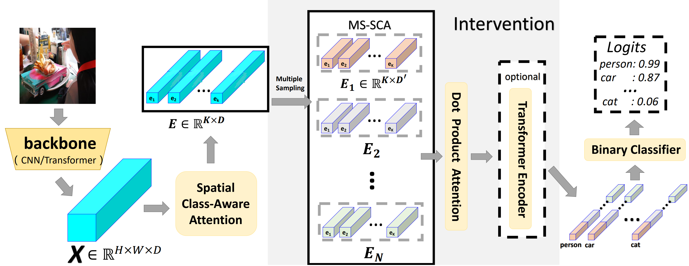
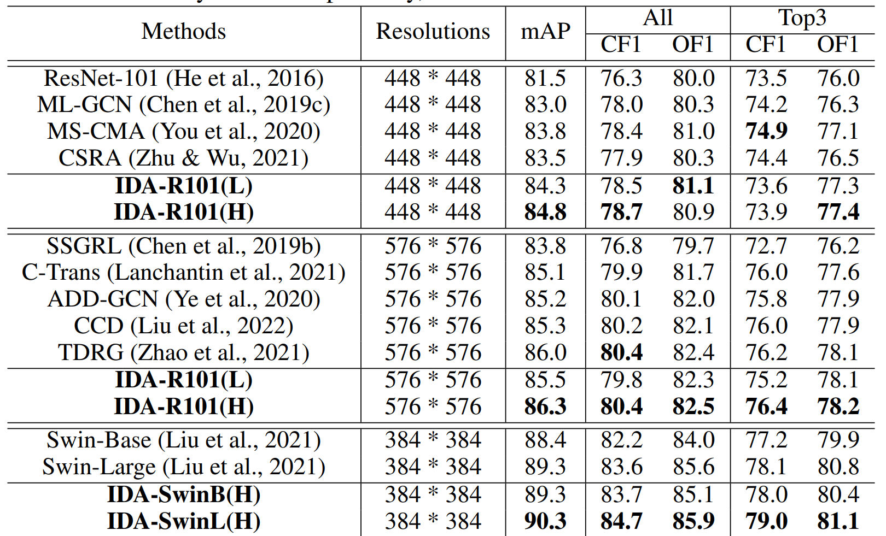

# IDA_2023ICLR
 Unofficial PyTorch implementation of the paper "Robust Attention for Contextual Biased Visual Recognition" ICLR2023.

[](https://paperswithcode.com/sota/multi-label-image-classification-on-mscoco?p=causality-compensated-attention-for)

# Introdunction
Unofficial PyTorch implementation of the paper ["Causality Compensated Attention for Contextual Biased Visual Recognition "](https://openreview.net/forum?id=8XqDnrmZQNF).
## Abstract

Visual attention does not always capture the essential object representation desired for robust predictions. Attention modules tend to underline not only the target object but also the common co-occurring context that the module thinks helpful in the training. The problem is rooted in the confounding effect of the context leading to incorrect causalities between objects and predictions, which is further exacerbated by visual attention. In this paper, to learn causal object features robust for contextual bias, we propose a novel attention module named Interventional Dual Attention (IDA) for visual recognition. Specifically, IDA adopts two attention layers with multiple sampling intervention, which compensates the attention against the confounder context. Note that our method is model-agnostic and thus can be implemented on various backbones. Extensive experiments show our model obtains significant improvements in classification and detection with lower computation. In particular, we achieve the state-of-the-art results in multi-label classification on MS-COCO and PASCAL-VOC. 



## Results on MS-COCO:



# Quick start
0. (optional) Star this repo. 

1. Clone this repo:
```sh
git clone git@github.com:yu-gi-oh-leilei/IDA_2023ICLR.git
cd IDA_2023ICLR
```

2. Install [```cuda```](https://developer.nvidia.com/cuda-downloads), [```PyTorch``` and ```torchvision```](https://pytorch.org/).

Please make sure they are compatible.
We test our models on two envs and other configs may also work:
```sh
cuda==11, torch==1.9.0, torchvision==0.10.0, python==3.7.3
or
cuda==10.2, torch==1.6.0, torchvision==0.7.0, python==3.7.3
```

3. Install other needed packages.
```sh
pip install -r requirments.txt
```

4. Data preparation.

Download [MS-COCO 2014](https://cocodataset.org/#download).

5. Train
```sh
# single node multi processes
torchrun --nnodes=1 --nproc_per_node=4 --rdzv_id=100 --rdzv_backend=c10d \
main_mlc.py -a 'IDA-R101-448' \
--dataset_dir '/media/data/maleilei/MLICdataset/' \
--backbone resnet101 --dataname coco14 --batch-size 128 --print-freq 400 \
--output './checkpoint/IDA/ResNet_448_MSCOCO14/bce_attention_bs128_work2' \
--world-size 1 --rank 0 --dist-url tcp://127.0.0.1:3718 \
--gamma_pos 0 --gamma_neg 0 --dtgfl --loss_clip 0 \
--epochs 80 --lr 1e-4 --optim Adam_twd --pretrained \
--num_class 80 --img_size 448 --weight-decay 1e-4 \
--cutout --n_holes 1 --cut_fact 0.5 --length 224 \
--nheads 4 --use_intervention --heavy \
--early-stop \
--use_BN \
--ema-decay 0.9997 --amp \
--seed 1 \
--lr_scheduler OneCycleLR \
--pattern_parameters add_weight \
--gpus 0,1,2,3
```


# BibTex
```
@inproceedings{liurobust,
  title={Robust Attention for Contextual Biased Visual Recognition},
  author={Liu, Ruyang and Huang, Jingjia and Li, Ge and Li, Thomas H},
  booktitle={International Conference on Learning Representations}
}
```

# Acknowledgement
We thank the authors of [query2labels](https://github.com/SlongLiu/query2labels), [ASL](https://github.com/Alibaba-MIIL/ASL), and [Swin-Transformer](https://github.com/microsoft/Swin-Transformer) for their great works and codes.
Thanks to @mrT23 for sharing training tricks and providing a useful script for training.